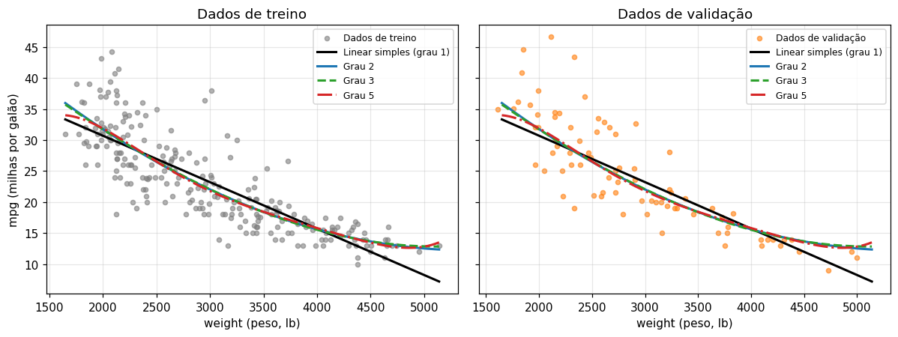

# Previsão do consumo de combustível de automóveis com regressão linear simples, múltipla e polinomial
#link streamlite:https://auto-mpg-exploratory-data-analysis-machine-learning-dkgunnnrbt.streamlit.app/
## Resumo

| Item | Descrição |
|---|---|
| Problema | Regressão: prever `mpg` (quantidade contínua) de um carro a partir de peso, potência e ano do modelo |
| Dados | *Auto MPG* (UCI/Kaggle): 398 carros reais, modelos de 1970 a 1982 |
| Modelos | Baseline (média), linear simples (`weight`), linear múltipla (`weight`, `horsepower`, `model_year`) e polinomial em `weight` (graus 2, 3 e 5) |
| Protocolo | Separação 60/20/20 (`random_state=42`); atributos e grau escolhidos na validação; teste usado uma única vez, após reajuste em treino + validação |
| Métricas | MAE, RMSE (em mpg) e R² |

## Principais resultados (conjunto de teste, n = 80)

| Modelo final | MAE (mpg) | RMSE (mpg) | R² |
|---|---|---|---|
| Baseline (média) | 5,955 | 7,347 | −0,004 |
| Linear simples (`weight`) | 3,118 | 3,859 | 0,723 |
| Polinomial grau 2 (`weight`) | 2,799 | 3,626 | 0,755 |
| **Linear múltipla** | **2,453** | **3,073** | **0,824** |

- Adicionar **informação nova** (`model_year`) reduziu o erro muito mais do que aumentar o **grau** do polinômio: na validação, o RMSE foi de 4,90 (simples) para 4,74 (grau 2) e para 4,03 mpg (múltipla); os graus 3 e 5 não melhoraram o grau 2.
- Não houve evidência clara de sobreajuste; o grau 5 apresenta comportamento pouco plausível nas bordas da faixa de peso.
- Os resíduos mostram variância não constante (funil): carros muito econômicos são os mais difíceis de prever.

<p align="center">
  <br>
  <em>Reta e curvas de graus 2, 3 e 5 sobre <code>weight</code> (treino e validação).</em>
</p>

## Estrutura do repositório

```
.
├── README.md
├── notebooks/
│   └── Nome_RA_Unidade2_Regressao.ipynb   # experimento completo, executado
├── relatorio/
│   └── Nome_RA_Unidade2_Relatorio.pdf     # relatório de análise
├── data/
│   └── README.md                          # como obter o CSV (o arquivo não é versionado)
├── figuras/                               # gráficos exportados do notebook
├── docs/
│   └── Atividade_Pratica_Regressao_Unidade2.pdf   # enunciado da atividade
├── requirements.txt
├── LICENSE
└── .gitignore
```

## Como reproduzir

**No Google Colab (recomendado):** abra o notebook pelo botão acima e use *Ambiente de execução → Executar tudo*. O notebook baixa o dataset automaticamente (veja [`data/README.md`](data/README.md)).

**Localmente:**

```bash
git clone <URL-DO-REPOSITORIO>
cd <NOME-DO-REPOSITORIO>
python -m venv .venv && source .venv/bin/activate    # Windows: .venv\Scripts\activate
pip install -r requirements.txt
# coloque o auto-mpg.csv em data/ (ou deixe o notebook baixar via kagglehub)
jupyter lab notebooks/Nome_RA_Unidade2_Regressao.ipynb
```

> O notebook procura `auto-mpg.csv` na pasta atual ou em `/content`. Ao rodar localmente a partir de `notebooks/`, copie o arquivo para essa pasta ou deixe o download automático agir. As figuras são gravadas em `figuras/` relativa à pasta de execução.

## Metodologia (resumo)

1. **Limpeza:** `?` em `horsepower` convertido para NaN (6 registros, mantidos); sem duplicatas; nenhum valor extremo removido.
2. **Separação antes da exploração:** 60% treino, 20% validação e 20% teste; as mesmas linhas em todos os cenários.
3. **Sem vazamento:** imputação por mediana e `StandardScaler` dentro de `Pipeline`, aprendidos só no treino.
4. **Seleção na validação:** conjunto de preditores da múltipla e grau do polinômio, pelo RMSE de validação.
5. **Avaliação final:** reajuste em treino + validação e uma única avaliação no teste.
6. **Diagnóstico:** reais × previstos, resíduos × previstos, maiores erros e VIF.

## Dados

*Auto MPG* (Quinlan, 1993), UCI Machine Learning Repository, versão do Kaggle `uciml/autompg-dataset`. Dados reais, licença CC BY 4.0. Detalhes e instruções em [`data/README.md`](data/README.md).

## Limitações

Amostra pequena (80 registros por conjunto de avaliação) e uma única separação aleatória; dados de 1970–1982, ciclo urbano e majoritariamente de carros americanos; o mesmo modelo de carro pode aparecer em anos diferentes (independência parcial); colinearidade entre peso, potência e cilindrada. As previsões não devem ser extrapoladas para carros modernos. Discussão completa no [relatório](relatorio/Nome_RA_Unidade2_Relatorio.pdf).

## Referências

- QUINLAN, R. *Auto MPG*. UCI Machine Learning Repository, 1993. https://doi.org/10.24432/C5859H
- NEWMAN, P. W. G.; ALIMORADIAN, B.; LYONS, T. J. Estimating Fleet Fuel Consumption for Vans and Small Trucks. *Transportation Science*, 23(1), 46–50, 1989. https://doi.org/10.1287/trsc.23.1.46
- scikit-learn: [LinearRegression](https://scikit-learn.org/stable/modules/generated/sklearn.linear_model.LinearRegression.html), [PolynomialFeatures](https://scikit-learn.org/stable/modules/generated/sklearn.preprocessing.PolynomialFeatures.html), [DummyRegressor](https://scikit-learn.org/stable/modules/generated/sklearn.dummy.DummyRegressor.html), [métricas de regressão](https://scikit-learn.org/stable/modules/model_evaluation.html#regression-metrics) e [armadilhas comuns](https://scikit-learn.org/stable/common_pitfalls.html)

## Licença

Código e texto sob licença MIT (ver [`LICENSE`](LICENSE)). Os dados pertencem aos seus autores originais e seguem a licença CC BY 4.0. O enunciado em `docs/` é material da disciplina e não está coberto pela licença deste repositório.
